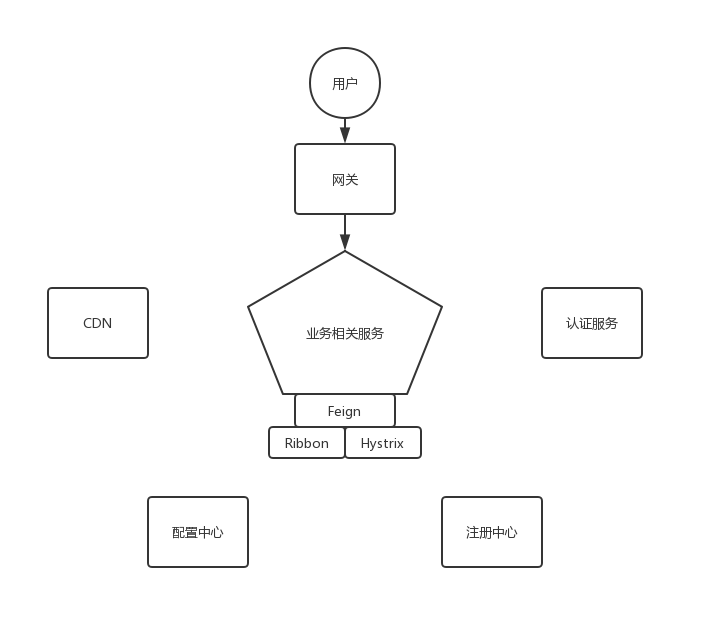

# tryboot

tryboot 项目采用 [微服务架构 (microservice)](https://martinfowler.com/articles/microservices.html) 搭建，使用 spring boot, spring cloud 技术栈。

本项目完成了简单的秒杀系统逻辑。


## 架构划分

请点击端口查看部署实例 !

|    服务名    |          功能简述           |                           部署端口                           | 实例个数 |
| :----------: | :-------------------------: | :----------------------------------------------------------: | :------: |
| api-gateway  |  Spring Cloud Gateway网关   |                              80                              |    1     |
|   registry   |     Eureka注册中心集群      | [8762](http://47.107.38.165:8763), [8763](http://47.107.38.165:8763) |    2     |
| auth-service |          认证服务           |              [5000](http://47.107.38.165:5000)               |    1     |
| good-service |       商品与订单服务        |                             8600                             |    1     |
|    config    | Spring Cloud Config配置中心 |                             8888                             |    1     |
|     cdn      | 为静态资源提供CDN, 独立部署 |              [8081](http://47.107.38.165:8081)               |    1     |

示意图如下所示: 




## 基础设施搭建

### 搭建 eureka 服务器集群

本项目中搭建了两个 eureka 实例, 与zookeeper 不同的是 eureka 注重最终一致性.

实例注册表的最终一致性主要靠实例之间的心跳包发送和时间戳机制实现.

配置注意点如下:

```YML
spring:
  application:
  # 注意到不同实例的服务名相同, 实例名不同, 这才体现所谓"集群"
    name: registry

eureka:
  instance:
    prefer-ip-address: true
    hostname: registry*
  client:
    service-url:
    # service-url是Map: private Map<String, String> serviceUrl = new HashMap<>();
    # defaultZone意义是, 这个实例是在defaultZone这个zone中
    # 而默认情况下defaultZone中的值为http://127.0.0.1:8761/eureka/
    # 发现其他不同zone的实例不会加入自己的对等节点集合(体现在PeerEurekaNodes)
    # 因此不会同步
      defaultZone: http://127.0.0.1:8762/eureka/,http://127.0.0.1:8763/eureka/

```


### 搭建Oatuh2认证服务器

使用默认的 oauth2 token 实现, 随机的 token 作为 key 值被存储在 Redis 中, value 存储的是对应这个 token 的认证信息.

不使用 JWT token 的原因是:

- 考虑到token安全性 (JWT自身携带认证信息) 和代码工作量 (JWT 需要考虑到信息加密) .
- 在用户量和微服务数量较低时, 依赖于Redis 的 token 存储不会产生很大内存消耗.


#### 基于`application.yml`的客户端认证信息配置方法

主要使用了`@ConfigurationProperties(prefix = "security.oauth2.server")`来读取`application.yml`配置, 将所有配置依次提取并加入配置.

配置标准与`security.oauth2.client`系配置标准完全相同.


#### 基于 Redis 的 token 存储

1. 加入`spring-boot-starter-data-redis`依赖, 默认连接本机端口6379.
2. 配置使用 `RedisTokenStore` 来存储token.

```java
//Oauth2ServerConfig.java

	@Override
    public void configure(AuthorizationServerEndpointsConfigurer endpoints) {

        endpoints
                .allowedTokenEndpointRequestMethods(HttpMethod.GET, HttpMethod.POST)
                .tokenStore(tokenStore)
                //注入authenticationManager来支持 password grant type
                .authenticationManager(authenticationManager);
    }
    
    @Configuration
    public static class TokenStoreConfig {
		//在开启jwt模式时不使用RedisTokenStore
        @ConditionalOnProperty(name = "security.oauth2.server.enable-jwt-token", havingValue = "false")
        @Bean
        @Autowired
        public TokenStore redisTokenStore(RedisConnectionFactory redisConnectionFactory) {
            return new RedisTokenStore(redisConnectionFactory);
        }
    }
```


### 搭建Oauth2客户端

#### 微服务的认证

当微服务使用 Feign 调用其他微服务时, 需要首先向认证服务器获取token.

Feign 是基于`RestTemplate` 的声明式RESTful Http API (用户提供接口, Feign使用JDK动态代理调用`RestTemplate` 发起请求并封装响应, 类似于Mybatis) .

使用`OAuth2FeignRequestInterceptor`, 在Feign请求发起前进行拦截, 从上下文(`OAuth2ClientContext`)中或者认证服务器获取 token. 

```JAVA
    @Bean
    @ConfigurationProperties(prefix = "security.oauth2.client")
    public ClientCredentialsResourceDetails clientCredentialsResourceDetails() {
        return new ClientCredentialsResourceDetails();
    }

    @Bean
    public RequestInterceptor oauth2FeignRequestInterceptor() {
        return new OAuth2FeignRequestInterceptor(new DefaultOAuth2ClientContext(), 
        clientCredentialsResourceDetails());
    }
```

`RequestInterceptor`原理如下:

```JAVA
  Request targetRequest(RequestTemplate template) {
    for (RequestInterceptor interceptor : requestInterceptors) {
      interceptor.apply(template);
    }
    return target.apply(template);
  }
```

#### Web端认证

Web端认证将使用 JavaScript 实现, 将token保存在浏览器内存中.

### 搭建资源服务器

- `@EnableResourceServer`启动了`OAuth2AuthenticationProcessingFilter`过滤器来处理请求中的token.

- `@EnableResourceServer`使`WebSecurityConfigurerAdapter`中的HTTP安全配置失效,, 因为其引入了一个继承了`WebSecurityConfigurerAdapter`的`ResourceServerConfiguration`. 故用户必须继承`ResourceServerConfigurerAdapter`来配置HTTP安全, 并且由于是在`OAuth2AuthenticationProcessingFilter`之后的过滤器中再代理给controller方法的前置授权, 它具有更高的优先级.

- `@EnableGlobalMethodSecurity(prePostEnabled = true)`启动了controller方法的前置与后置授权, 原理是CGLIB代理.

```java
@EnableResourceServer
@EnableGlobalMethodSecurity(prePostEnabled = true)
@EnableWebSecurity(debug = true)
@Configuration
public class Oauth2ServerConfig extends ResourceServerConfigurerAdapter {

}
```


### Spring Cloud Gateway 网关搭建

routes有order域, 可以设置优先级.

如果请求满足某个route的断言`Predicate`, 将会被路由到它的URI.

```YML
spring:
  application:
    name: api-gateway
  cloud:
    gateway:
      routes:
        - id: auth-service
          uri: lb://auth-service/
          predicates:
            - Path=/auth/**

        - id: good-service
          uri: lb://good-service/
          predicates:
            - Path=/order/**, /good/**, /seckill/**
```


## 业务问题

### 同一用户多次购买

假设同一用户同时访问到了秒杀URL多次, 同时判断订单不存在并在减库存后在订单表中生成了订单信息, 将会出现相同用户多次购买同一秒杀商品的问题.

持久层解决方法: 在订单表上创建关联用户id和秒杀商品id的唯一索引, 因此同一用户同一秒杀商品只会生成一个订单.

### 库存超卖

通过在sql语句中加上库存数目的判断, 库存不够将不减库存.

```sql
update seckill_good
set stock_count = stock_count - #{goodCnt}
where id = #{seckillGoodId}
  and stock_count >= #{goodCnt}
```


## 访问速度优化

### 静态资源优化

1. 前后端分离, 服务器不需要渲染页面, 减少了服务器压力, 降低网络带宽使用, 提高了响应速度.
2. 静态资源大量使用CDN访问(js, css, font, image), 提高响应速度, 减少了业务服务器访问量.

### 对象缓存

在持久层和业务逻辑层中构建缓存层, 从数据库拿出 data object 之前, 先尝试从 Redis 中拿出, 减少MySQL的访问, 提高响应速度.

- 商品详情
- 订单详情

## 高并发优化

### 异步处理下单操作并保存结果，轮询获取结果

客户下单请求：

1. 秒杀请求先访问 Redis 判断该商品是否有库存, 如果是, 下一步; 否则返回失败. 
2. 秒杀请求进入消息队列, 通知客户端轮询秒杀结果.

监听RabbitMQ中的下单请求队列，异步接收消息：

1. 快速判断商品是否没有库存，若否，在Redis保存秒杀结果并返回 
2. 判断同一用户同一商品的订单是否存在，若是，在Redis保存秒杀结果并返回 
3. 尝试减库存，如果失败，在Redis中保存结果并返回 
4. 尝试生成订单信息，如果失败，保存结果并抛出异常（为了让减库存操作回滚）

前端轮询秒杀请求结果：

1. 每隔200ms访问Redis有没有订单结果（按照用户名和商品id）。如果有，在Redis中删除这个键值并返回结果
2. 如果没有，通知前端继续轮询。


## 系统安全

### 数字验证码与秒杀地址隐藏

设置数字图片验证码来验证用户身份，隐藏下单地址，防止恶意刷单


### 限流操作

在网关对请求秒杀路径进行限流操作，防止高并发导致服务器崩溃。


## 逻辑问题

### 原始类型与包装类型造成的 NPE

在[迭代加载POJO中的配置过程](#基于`application.yml`的客户端认证信息配置方法)中, 出现`java.lang.NullPointerException`

```JAVA
@Override
public void configure(ClientDetailsServiceConfigurer clients) throws Exception {

    //基于YML配置, 请在配置文件中添加相关配置
    InMemoryClientDetailsServiceBuilder inMemoryClientDetailsServiceBuilder = clients.inMemory();

    for (Oauth2ServerClientsProperties.Oauth2ClientProperties client : oauth2ServerClientsProperties.getClients().values()) {
        ClientDetailsServiceBuilder.ClientBuilder builder = inMemoryClientDetailsServiceBuilder
                .withClient(client.getClientId())
                .authorizedGrantTypes(client.getAuthorizedGrantTypes())
                .authorities(client.getAuthorities())
                .scopes(client.getScopes())
                .autoApprove(client.getAutoApproveScopes())
                .autoApprove(client.isAutoApprove())
                .secret(client.getSecret())
                .redirectUris(client.getRedirectUris())
                .resourceIds(client.getResourceIds());

        //由于配置方法的参数是原始类型, 必须进行非空校验再传入
        if (client.getAccessTokenValiditySeconds() != null) {
            builder.accessTokenValiditySeconds(client.getAccessTokenValiditySeconds());
        }
        if (client.getRefreshTokenValiditySeconds() != null) {
            builder.refreshTokenValiditySeconds(client.getRefreshTokenValiditySeconds());
        }
    }
}
```

配置方法源码:

```JAVA
		public ClientBuilder accessTokenValiditySeconds(int accessTokenValiditySeconds) {
			this.accessTokenValiditySeconds = accessTokenValiditySeconds;
			return this;
		}

		public ClientBuilder refreshTokenValiditySeconds(int refreshTokenValiditySeconds) {
			this.refreshTokenValiditySeconds = refreshTokenValiditySeconds;
			return this;
		}
```


## 部署

本项目在本人的阿里云服务器上进行部署.

### 为什么不使用 docker?

DOCKER主要是解决了多依赖的部署环境下的自动部署问题. 由于项目依赖的环境相对简单(JDK, Redis, MySQL), 所以没有考虑使用DOCKER进行部署.

### 部署解决方案

比较简单粗暴.

1. 使用`sshfs`远程挂载服务器文件系统, `ssh`远程连接到命令行.

2. 使用maven进行打包, 完成后将jar包copy到服务器上.

3. 在服务器命令行上使用`java -jar &`命令来启动服务.
